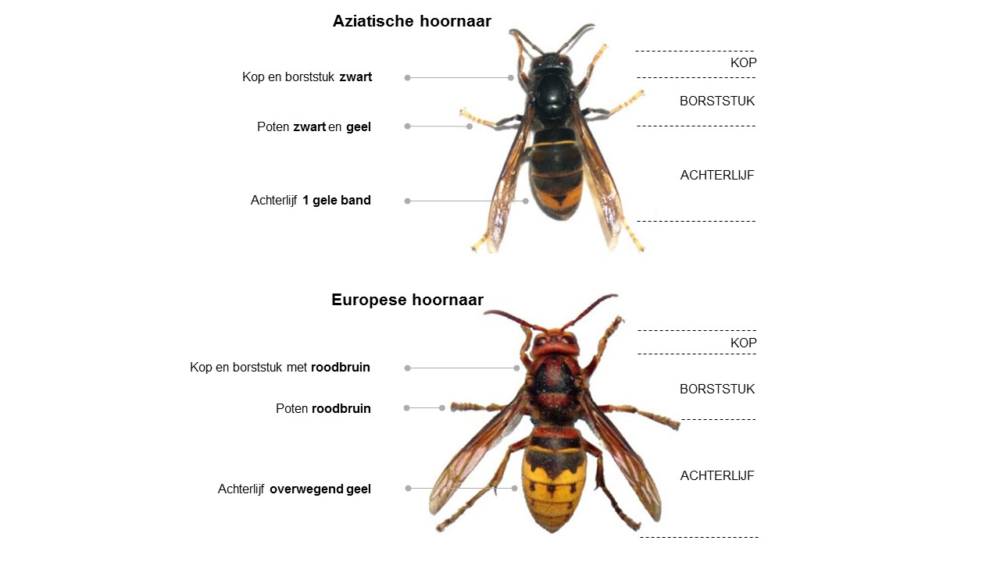

## Grootte

In België zijn op dit moment twee soorten hoornaars te vinden: de Aziatische en de Europese hoornaar. 
Hoornaars zijn **een flink stuk groter dan bijen en wespen**. De meeste bijen- en wespensoorten worden niet 
groter dan 20 mm, wat kleiner is dan een € 1 muntstuk. Hoornaars zijn opvallend groter en forser gebouwd. 
De Aziatische hoornaar is net iets kleiner dan de Europese hoornaar; in cijfers uitgedrukt varieert de lichaamslengte van de Aziatische hoornaar tussen 20 en 30 mm en dat van de Europese hoornaar tussen 25 en 35mm.

<figure class="align-center">
  
  <figcaption>(figuur via ecotuinweetjes)</figcaption>
</figure> 

## Kleur

Een groot, vliegend insect is dus niet perse de Aziatische hoornaar. Gelukkig vergt het maar een kleine oefening om het onderscheid tussen de Europese en Aziatische hoornaar te leren kennen. Het kleurpatroon is daarbij doorslaggevend; en wel de **kleur van de bovenzijde van het lichaam en de kleur van de poten**. De kop en het borststuk van de Aziatische 
hoornaar is volledig zwart. Het achterlijf is overwegend zwart met slechts één brede gele band. De poten zijn ook zwart 
afgezonderd van de opvallend gele uiteinden (de tarsen of voetjes). De Europese hoornaar heeft naast zwart en geel ook 
een derde kleur, roodbruin. Zo is de kop volledig roodbruin van bovenaf gezien en het borststuk is zwart met enkele 
roodbruine tekeningen. Verder bekleurt het achterlijf van de Europese hoornaar voor tweederden geel. Tenslotte zijn 
de poten van de Europese hoornaar volledig roodbruin. Kortom, waar de Europese hoornaar een gele (en soms rode) indruk 
nalaat, is de Aziatische hoornaar donker zwart. 

{: .align-center}

## Nesten

Wespen maken hun nest uit dood hout dat ze verzamelen in de natuur. Het resultaat is een lichtbruine structuur die 
je vaak in een beschutte plaats aantreft. De **Aziatische hoornaar maakt een bol- tot peervormig nest** dat groeit gedurende 
het seizoen. In het voorjaar vanaf eind Maart bouwt de koningin een bolvormig nestje ter grootte van een tennisbal. 
Ze verkiest hiervoor **een beschutte plaats zoals een schuur, een houthok of een carport**. Voorjaarsnesten worden ook 
aangetroffen op een zolder, onder de overloop van een dak of in een dichte haag (vb. Beuk en Haagbeuk) De koninginnen 
zijn verre van kieskeurig als het aankomt op het zoeken van een geschikte nestplaats. Een of meerdere openingen die dienen 
als vlieggat bevinden zich aan de zijkant van het nest. Dit in tegenstelling tot de Europese hoornaar die haar vlieggat 
aan de onderkant van het nest maakt.

<figure style="width: 300px" class="align-center">
  
  <figcaption>Primair nest Waregem.</figcaption>
</figure>
<figure style="width: 300px" class="align-center">
  
  <figcaption>Secundair nest.</figcaption>
</figure>
<figure style="width: 300px" class="align-center">
  
  <figcaption>Voorjaarsnest Boezinge.</figcaption>
</figure>
<figure style="width: 300px" class="align-center">
  
  <figcaption>Voorjaarsnest Roeselare.</figcaption>
</figure> 
<figure style="width: 300px" class="align-center">
  
  <figcaption>Najaarsnest Zonnebeke.</figcaption>
</figure> 

> Tip: als je een Aziatische hoornaar ziet in de maanden april-juni, kijk dan uit naar de voorjaarsnesten op 
beschutte plaatsen. Vanaf juli kan je nesten ook in boomtoppen aantreffen.

Gedurende de lente groeit het nest verder uit. Als het nest breder dan 25 cm diameter bereikt wordt er gesproken van 
een secundair nest of najaarsnest. Dit kan al vanaf de maand mei. Hoe groter het nest wordt, hoe actiever de hoornaars 
en hoe meer voedsel ze nodig hebben om hun nakomelingen te voeden. In geval van bedreiging of voedseltekort kan de 
Aziatische hoornaar beslissen om een nieuw nest te bouwen op een betere plaats. Als locatie wordt vaak een hoge boomtop 
gekozen. Boomsoorten als Eik, Populier, Berk en Den zijn de voorkeur soorten waarin nesten worden gebouwd. Deze nesten 
zijn moeilijk om te vinden aangezien ze pas duidelijk zichtbaar worden als de bladeren afvallen in de herfst. 
Bovendien kunnen ze soms verward worden met maretak of vogelnesten. 

## Gedrag

<figure style="width: 300px" class="align-left">
  
  <figcaption>Aziatische hoornaar.</figcaption>
</figure> 

Aziatische hoornaars jagen op honingbijen aan de vliegopening van een bijenkast. Ze hangen als een helikopter stil in de lucht en wachten tot een honingbij komt aanvliegen, die ze grijpt met enig gestuntel. Vervolgens vliegt de hoornaar iets verderop om haar prooi te ontleden. Ze behoudt gewoonlijk het borststuk dat wordt meegenomen naar het nest als voedsel voor de nakomelingen.    

<figure style="width: 300px" class="align-right">
  
  <figcaption>Europese hoornaar.</figcaption>
</figure> 
De Europese hoornaar heeft een gelijkaardig gedrag. Enig verschil is te onderscheiden waar de Europese hoornaar zelden stil in de lucht blijft hangen voor de bijenkast.    

Als een nest in de buurt is dan tref je in het najaar geregeld hoornaars aan op bloeiende Klimop en Sneeuwbes ( *Symphoricarpos* ). De nectar die de hoornaar drinkt dient als brandstof voor de vele kilometers die ze dagelijks aflegt.

<figure style="width: 300px" class="align-center">
  
  <figcaption>Klimop.</figcaption>
</figure>
<figure style="width: 300px" class="align-center">
  
  <figcaption>Sneeuwbes.</figcaption>
</figure> 

