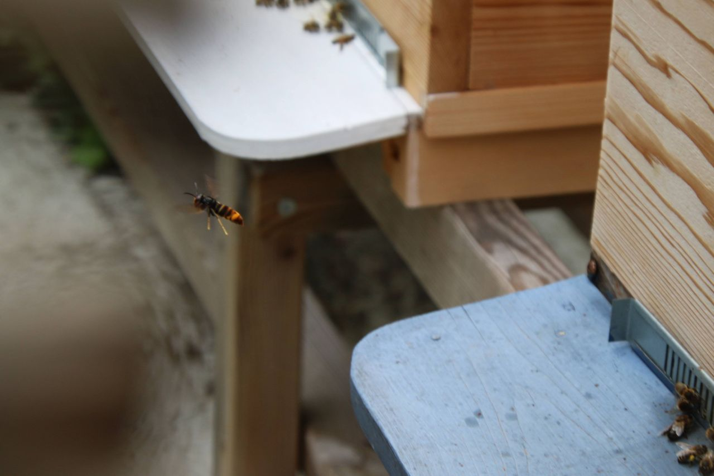

De Aziatische hoornaar, wetenschappelijke naam *Vespa velutina nigrithorax*, is een invasieve wespensoort afkomstig uit China. In 2004 kwam de soort Europa binnen via internationale handel en werd voor eerst gesignaleerd in Zuidwest-Frankrijk (departement Lot-et-Garonne). Sindsdien verspreidde de exoot zich in snel tempo over buurlanden Spanje, Portugal, Italië, Zwitserland en Duitsland. In 2011 werd het eerste individu in België waargenomen. Pas in 2016 werd het eerste nest aangetroffen in de gemeente Guignies (Henegouwen).

{: .align-center}

De Aziatische hoornaar is schadelijke voor de biodiversiteit en de imkerij, want ze jaagt massaal op kleinere insecten zoals bijen, wespen en vliegen. De hoornaars bouwen grote nesten waarin gemiddeld 5000 nakomelingen worden grootgebracht. Daarvoor is een grote hoeveelheid voedsel nodig en blijft er minder over voor inheemse, nuttige rovers zoals de Europese hoornaar en libellen. Uit wetenschappelijk onderzoek blijkt dat het dieet van de Aziatische hoornaar voor 34% uit honingbijen bestaat in landelijk gebied (Villemant et al., 2011). In stedelijk gebied loopt dit percentage op tot 66%. De hoornaars jagen op honingbijen aan de vliegopening van bijenkasten.

<figure style="width: 300px" class="align-center">
  
  <figcaption>Aziatische hoornaar.</figcaption>
</figure>
<figure style="width: 300px" class="align-center">
  
  <figcaption>Europese hoornaar.</figcaption>
</figure>

 

Al te vaak wordt de Aziatische hoornaar verward met de Europese hoornaar of andere insecten zoals de Middelste wesp, bijen en hommels of de Stadsreus (een zweefvlieg). Via dit portaal wil Vespa-Watch tegemoet komen aan de herkenning van Aziatische hoornaars in Vlaanderen. Bovendien kan je ook een melding doen als je denkt een Aziatische hoornaar gespot te hebben. Zo helpt u mee aan het in kaart brengen van de Aziatische hoornaar in Vlaanderen.

Deze versie van de website is tijdelijk. In 2019 volgt een uitbreiding op deze versie met ***real time* monitoring**, een brede uiteenzetting over de **ecologie** van de Aziatische hoornaar en **beheeracties** voor de imkerij en bestrijding instanties (zoals de brandweer).
