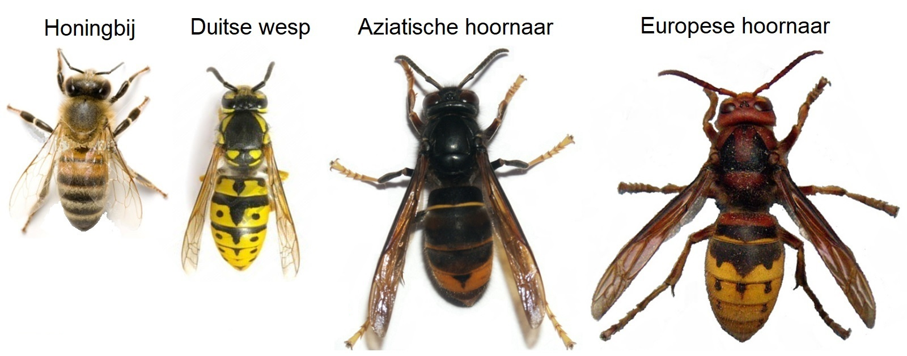

# Hoornaren herkennen

Hoornaars zijn bijna dubbel zo groot als een wesp of honingbij. Als eenvoudig trucje kan je de grootte van een 1 euro muntstuk in gedachten nemen. Hoornaars zijn altijd groter dan het muntstuk. 

In België komen twee hoornaarsoorten voor: de **Aziatische hoornaar** en de **Europese hoornaar**. De Aziatische hoornaar is net iets kleiner dan de Europese hoornaar. De koningin van de Aziatische hoornaar meet 3,5 centimeter van kop tot angel. Ze is iets kleiner dan de Europese hoornaar koningin, die een lengte van 4 cm haalt. De werksters en darren, of mannetjes, zijn kleiner dan de koningin. Aziatische hoornaar werksters en darren worden gemiddeld 2.5 - 3 cm groot, Europese hoornaars weerom iets groter met 3 tot 3.5 cm. Je zal natuurlijk de kans niet krijgen om een levende hoornaar nauwkeurig te meten. Gebruik eerder het kleurpatroon om Aziatische van Europese hoornaars te onderscheiden. 

## Zwart met lichtgele pootjes

Met 3 eenvoudige kleurkenmerken kan je de Aziatische hoornaar onderscheiden van de Europese hoornaar. In tegenstelling tot de structuur van lichaamsdelen kan de kleur soms variabel zijn. Bijvoorbeeld worden Aziatische hoornaars bleker naarmate ze langer vliegen. Of zijn de pootjes van Europese hoornaars soms geel in plaats van roodbruin gekleurd.  Houd daarom altijd rekening met mogelijke afwijkingen!

## Achterlijf

Het achterlijf van de Aziatische hoornaar is zwart met enkel één donkergeel achterlijfsegment (T4). Het achterlijf van de Europese hoornaar bestaat voor twee derden uit geel. Het eerste segment (T1) is roodbruin en zwart. De tip van het achterlijf is altijd geel. Meestal zijn 2 rijen van zwarte stippen op een gele achtergrond zichtbaar. 

## Pootjes

De pootjes van de Aziatische hoornaar zijn zwart met opvallend gele tippen. De pootjes van de Europese hoornaar zijn volledig roodbruin. In zeldzame gevallen kan de roodbruine kleur verbleken, maar er is nooit zwart te zien. De pootjes van kleinere wespensoorten zijn bijna volledig geel. 

## Borststuk

Het borststuk is het lichaamsdeel tussen kop en achterlijf waarop poten en vleugels vastzitten. De bovenzijde ervan is bij de Aziatische hoornaar volledig zwart gekleurd en bij de Europese hoornaar zwart met roodbruine tekeningen. De roodbruine kleur loopt door tot op de bovenkant van de kop. Op het zwarte borststuk van andere wespensoorten (gewone wesp, Duitse wesp) zijn nagenoeg altijd duidelijk gele strepen of stippen te zien.

# Andere insecten die lijken op een Aziatische hoornaar

7: vlnr,vbno: middelste wesp, Franse veldwesp, Gewone/Duitse wesp, Stadsreus, Hommel, Zwarte houtbij, Reuzenhoutwesp
    
- **Gewone en Duitse wesp (_Vespula vulgaris_ en _V. germanica_)**
Grootte: kleine wespensoorten, tot 2cm lang
Kleur: zwart en geel, met gele tekening op het borststuk.
Gedrag: papieren nest uit gekauwde houtvezels, vaak onder de grond
Onderscheidend kenmerk: geringe grootte, gele tekening op het borststuk, achterlijf geel met uitgebreide zwarte tekening. 

- **Middelste wesp (_Dolichovespula media_)**, donkere vorm.
Grootte: deze wesp is half zo groot als de hoornaar. 
Kleur: het achterlijf is afwisselend gestreept met fijne gele en brede zwarte strepen. De pootjes meer geel dan bij de Aziatische hoornaar. Het borststuk is zwart met zijdelings een gele, gehoekte streep. Naast deze donkere vorm ook een lichte vorm: lijkt dan sterk op een Gewone of Duitse wesp. 
Nest: vaak onbeschut in een boom lager dan 10 meter. Het nest lijkt op een omgekeerde druppel met de onderkant spits toelopend. Vlieggat onderaan, nooit zijdelings. Omhulsel slordig en kleur vaal bruin tot grijs. 
Onderscheidend kenmerk: achterlijf afwisselend geel en zwart gestreept.

- **Franse veldwesp (_Polistes dominula_)**.
Grootte: iets groter dan een bij, maar kleiner en vooral slanker gebouwd dan een hoornaar.
Kleur: het achterlijf is afwisselend geel en zwart gestreept. De lange pootjes zijn meer geel gekleurd en hangen in de vlucht. Het borststuk is zwart met een gele kraagband en enkele fijne gele stipjes.
Nest: kleine nestjes zonder omhulsel. Meestal in een beschutte locatie. 
Onderscheidende kenmerk: slanke lichaamsbouw.

- **Reuzenhoutwesp (_Urocerus gigas_)**
Grootte: Een volledig onschadelijke houtwesp die geen angel draagt en even groot is als een Aziatische hoornaar, vaak opvallend slanker gebouwd.
Kleur: achterlijf meer geel dan zwart, idem pootjes. Voelsprieten volledig geel, de Aziatische hoornaar heeft zwarte voelsprieten. Twee grote gele vlekken (facetogen) vooraan op de kop (donker bij de Aziatische hoornaar). 
Gedrag: wordt vaak op hout aangetroffen.
Onderscheidend kenmerk: brede uitstekende legboor achteraan het lichaam + gele voelsprieten

- **Hommels (_Bombus_)**
Grootte: werksters tussenin wesp en hoornaar. Koningin even groot, maar breder dan hoornaar.
Kleur: variabel. Meestal bruin of zwart in combinatie met witte poep en gele banden.
Nest: ondergronds, bloembak, tuinhuisje, vogelkast, boomholte. 
Onderscheidend kenmerk: veel beharing, wespen zijn doorgaans kaal.

- **Stadsreus (syn. Hoornaarzweefvlieg, _Volucella zonaria_)**
Grootte: tussenin wesp en hoornaar. Grote exemplaren soms even groot. Breder gebouwd.
Kleur: weinig zwart, veel roodbruin (borststuk). Doet denken aan een Europese hoornaar.
Gedrag: wordt vaak op een bloem aangetroffen. 
Onderscheidend kenmerk: lompe indruk, vleugels gespreid in rust. Wespen hebben vier vleugels, vliegen maar twee. 

- **Blauwzwarte houtbij (_Xylocopa violaceae_)**
Grootte: even groot als Aziatische hoornaar maar forser gebouwd.
Kleur: gitzwart. Andere kleuren ontbreken tenzij stuifmeel op het borststuk. Zwartgeblakerde vleugels. 
Gedrag: vaak op grote bloemen, eerder zeldzaam in Vlaanderen. 
Onderscheidend kenmerk: gitzwart over het gehele lichaam. 

# Nesten herkennen

De Aziatische hoornaar bouwt twee types nesten: een klein primair nest in de lente en een groot secundair nest vanaf de zomer. In 70% van de gevallen zal de kolonie verhuizen van primair naar secundair nest. De twee nest types verschillen in locatie en grootte. Afgezien van het type is de kleur van het nest altijd lichtbruin want het materiaal waaruit het nest bestaat is dode houtvezels. De Aziatische hoornaar nestelt het liefst in stedelijk gebied waar veel voedsel te vinden is. Doorgaans bouwt ze nesten dichtbij de mens (in tuinen, parken, stadsranden) of op het platteland. In een gebied met intensieve landbouw is relatief weinig voedsel voor de hoornaars te vinden. 

## Kleine voorjaarsnesten op een beschutte plaats

Van april tot juni bouwen Aziatische hoornaars het voorjaarsnest. Dit nest is altijd bolvormig en hangt op een plaats beschut tegen regen en wind. Voorbeelden zijn binnen in een schuur, een veranda, een tuinhuisje of een houthok, op een zolder of onder het dak van een carport. Voorjaarsnesten hangen meestal aan een horizontaal draagvlak zoals een plafond of een balk. De kleur is lichtbruin en de grootte varieert tussen een tennisbal en een kleine voetbal. De ingang van het nest zit onderaan. Het prille nest stadium waarin het nest niet groter is als een tennisbal is moeilijk te onderscheiden van Europese hoornaars of andere wespen. De primaire nesten zijn vaak in de nabijheid van water.
  
Links: voorjaarsnest hangt op aan een plafond (diameter: 8 cm)
Rechts: voorjaarsnest op een zolder (diameter: 15 cm)

## Grote zomernesten in een boomtop

Vanaf de zomer kan de kolonie verhuizen naar een verderop gelegen locatie. In dit geval wordt van een secundair nest of zomernest gesproken. De meeste zomernesten worden gebouwd in een boomtop hoger dan 10 meter. Die worden pas goed zichtbaar als de bladeren vallen in de herfst. Andere plaatsen waar zomernesten kunnen opgetrokken worden zijn hagen, schuren, loodsen, onder een dakoverloop of tegen een gevel. Soms verhuizen de hoornaars niet en bouwen ze het voorjaarsnest uit tot een zomernest. Zomernesten zijn bol- tot peervormig. Ze zijn lichtbruin in kleur en worden gemiddeld 50 cm (tot 90 cm) breed. De ingang van het nest is zijdelings. 
  
Links: zomernest gebouwd op dezelfde plaats als het voorjaarsnest
Rechts: typisch zomernest gebouwd in een boom en op een andere plaats dan het voorjaarsnest.

## Andere wespennesten

Alle wespen gebruiken dode houtvezels als nestbouwmateriaal.

8: vlnr,vbno: wespennest (voorjaar), wespennest (groot), nest Europese hoornaar, nest Middelste wesp, nest Franse veldwesp
   + foto MW westerlo
 
Verzameling van infofiches:
https://inpn.mnhn.fr/fichesEspece/Vespa_velutina_en.html

## Verwarring met maretak, vogelnest, boomkanker

In bomen vind je soms andere structuren die lijken op een Aziatische hoornaar nest. Vooral grote vogelnesten van eksters, kraaien of duiven die deze vogels hoog in een boomtop maken zorgen voor de meeste verwarring. Een vogelnest is slordig gebouwd en bestaat uit losse twijgen. Hierdoor zijn de contouren van het nest niet glad zoals het geval is bij een wespennest. Zowel van dichtbij als veraf zijn vogelnesten bovendien zeer donker van kleur. Wespennesten zijn lichtbruin en vallen minder op.

**Maretak (_Viscum album_)** (vogellijm, mistel) is een halfparasiet van loofbomen. De Canadapopulier is de voornaamste gastheer. Een maretak in een boomtop kan verward worden met het nest van de Aziatische hoornaar. Zoals vogelnesten is maretak donkerder en meer opvallend dan wespennesten. Maretak kom in Vlaanderen vooral voor in het zuiden van de provincies Vlaams-Brabant en Limburg (oostelijke Leemstreek).

Een grote vergroeiing van een boomstam of -tak is het gevolg van een schimmel of bacteriële infectie. In de volksmond wordt dan wel eens van een **boomkanker** gesproken. Meestal komt de vergroeiing voor in het onderste deel van de boom, dicht tegen de stam. In een boomtop komen ze minder vaak voor. 

 

---

# Hornet identification

Hornets are almost twice as big as a wasp or honeybee. A simple trick is to think of a 1 euro coin. Hornets are always bigger than the coin.

In Belgium two hornet species occur: the **Asian hornet** and the **European hornet**. The Asian hornet is slightly smaller than the European hornet. An Asian hornet queen measures 3.5 cm. This is slightly smaller than a European hornet queen, with a length of 4 cm. Workers and drones, or males, are smaller than queens. Asian hornet workers and drones are on average 2.5-3 cm long, European hornets are slightly larger with 3-3.5 cm. You will of course probably not get the chance to accurately measure a live hornet. To distinguish Asian from European hornets, use the colour pattern.

## Black with yellow legs

Three simple color features allow to distinguish an Asian from a European hornet. Bear in mind colors are sometimes variable. For example, Asian hornets become paler with age and become worn off. Also, the legs of European hornets are sometimes yellow instead of red-brown. 

## Black abdomen

The abdomen of an Asian horn is black with only one dark yellow abdomen segment (T4). The abdomen of the European hornet is yellow for two thirds. The first segment (T1) is red-brown and black. The tip of the abdomen is always yellow. Usually two rows of black dots are visible on a yellow background.

## Yellow legs

The legs of Asian hornet are black with distinctive yellow tips. The legs of the European hornet are completely red-brown. In rare cases the red-brown color may fade, but the legs are never black. The legs of smaller wasp species (common yellowjacket, German yellowjacket) are almost completely yellow.

## Thorax entirely black

The thorax is the part of the body between the head and the abdomen on which the legs and wings are attached. In Asian hornets, the upperside of the thorax is entirely black, whereas European hornets have red-brown markings on a dark background. The red-brown color extends to the top of the head. The black thorax of other wasp species (common yellowjacket, German yellowjacket) almost always has clear yellow stripes or dots.

# Other look-alike insects

![pictures]
7: left to right, vbno: middle wasp, French field wasp, Common / German wasp, City giant, Bumblebee, Black wood bee, Giant wood wasp
    
- **common and German yellowjacket (_Vespula vulgaris/germanica_)**
Size: small wasp species, up to 2cm long
Color: black and yellow, with yellow markings on the thorax.
Behavior: build paper nest from chewed wood fibers, often underground.
Distinctive feature: small size, yellow drawing on the breast piece, abdomen yellow with extensive black markings.

- **median wasp (_Dolichovespula media_)**, dark form.
Size: half the size of a hornet.
Color: the abdomen is alternately striped with fine yellow and wide black stripes. The legs are more yellow than with Asian hornet. Thorax is black with a yellow, hooked lateral line. In addition to this dark a lighter form exists that resembles common and German yellowjacket.
Nest: often unprotected in a tree, below 10 meters. The nest looks like an inverted drop with the bottom tapering. The hole is at the bottom, never on the side. Casing is sloppy and pale brown to gray.
Distinctive feature: abdomen alternately yellow and black.

- **European paper wasp (_Polistes dominula_)**.
Size: slightly larger than a bee, but smaller and especially slimmer than a hornet.
Color: the abdomen is alternately yellow and black. The long legs are more yellow and are left hanging in flight. Thorax black with a yellow collar and some finer yellow dots.
Nest: small nests without sheath. Usually in sheltered locations.
Distinctive feature: slender wasp species.

- **Giant wood wasp (_Urocerus gigas _)**
Size: A completely harmless wood wasp that does not wear a sting and is the size of an Asian hornet, often remarkably slim.
Color: abdomen more yellow than black, same for the legs. Antennae yellow, Asian hornet has black antennae. Two large yellow spots (facet eyes) on the front of the head (dark in Asian hornet).
Behavior: often found on wood.
Distinctive feature: projecting ovipositor at the back of the body, yellow antennae.

- **Bumblebees (_Bombus _)**
Size: workers in between wasp and hornet. Queen the same size, but chubbier than hornets.
Color: variable. Mostly brown or black in combination with white tip and yellow bands.
Nest: under ground, flower boxes, garden shed, birdhouses, tree cavities.
Distinctive feature: hairy, wasps are usually bald.

- **Hornet hoverfly (_Volucella zonaria_)**
Size: between wasp and hornet, one pair of wings (wasps have four wings). 
Color: little black, a lot of reddish-brown (chest piece). Reminds more of European hornet.
Behavior: often found on flowers.
Distinctive feature: very orangy, one pair of wings spread out at rest.

- **violet carpenter bee (_Xylocopa violaceae_)**
Size: the size of an Asian hornet, but more chubby.
Color: entirely black and shiny. Dark wings have violet and blue reflections. Other colors are missing unless pollen is stuck on the thorax. 
Behavior: often on large flowers, rather rare in Flanders.
Distinctive feature: black and shiny with violet and blue reflections.

# Nest identification

Asian hornets build two types of nests: a small primary nest in spring and a larger secondary nest as from summer. In 70% of the cases, the colony will move from primary to secondary nest. The two nest types differ in location and size. Regardless the type, the color of the nest is always light brown as it is made up of dead wood fiber. Asian hornets prefer to nest in urban areas where a lot of food can be found. Nests are usually found close to habitation (in gardens, parks, city edges) or in the countryside. In areas with intensive agriculture, relatively little food can be found for the hornets.

## Small spring nests in a sheltered place

From April to June, Asian hornets build their spring nest. This nest is always spherical and located in a sheltered place protected from rain and wind: inside a shed, a porch, a garden shed or a wood shed, in an attic or under the roof of a carport. Spring nests are usually attached to a horizontal base such as a ceiling. Their color is light brown and the size varies between a tennis ball and a small football. The entrance of the nest is at the bottom. The early nest stage, in which the nest is no bigger than a tennis ball, is difficult to distinguish from European hornets or other wasps. The primary nests are often in the vicinity of water.
  
![foto]Left: spring nest hangs on a ceiling (diameter: 8 cm)
![foto]Right: spring nest in an attic (diameter: 15 cm)

## Large summer nests in a treetop

In summer the colony can move to a nearby location. In this case, a secondary nest or summer nest is produced. Most summer nests are built in a treetop higher than 10 meters. They only become visible when the leafs fall in autumn. Other places where summer nests can be built are hedges, barns, sheds, under a roof overflow or against a façade. Sometimes the hornets do not move and they turn the spring nest into a summer nest. Summer nests are bulbous to pear-shaped. They are light brown in color and are on average 50 cm (up to 90 cm) wide. The entrance of the nest is on the side.
  
![foto]Left: summer nest built in the same place as the spring nest
![foto]Right: typical summer nest built in a tree and in a different place than the spring nest.

## Other wasp nests

All wasps use dead wood fibers as nest construction material.

![foto]
8: left to right, vbno: wasp nest (spring), wasp nest (large), nest European hornet, nest Middle wasp, nest French field wasp
   + photo MW westerlo
 
Collection of information sheets:
https://inpn.mnhn.fr/fichesEspece/Vespa_velutina_en.html

## Confusion with mistletoe, bird nests, tree cancer

In trees you can sometimes find other structures that resemble an Asian hornet nest. Especially larger nests of magpies, crows or pigeons, which breed in treetops, can cause confusion. A bird's nest is sloppily built and consists of separate twigs. As a result, from a distance, the contours of the nest are not as smooth as a wasp nest. Bird nests are also very dark in color. Wasp nests are light brown and are less noticeable.

**Mistletoe (_Viscum album_)** is a semi-parasite of deciduous trees. Canada poplar is the main host. A mistletoe in a treetop can be confused with the nest of the Asian hornet. Like bird nests, mistletoe is darker and more striking than wasp nests. In Flanders, mistletoe mainly occurs in the south of the provinces Brabant and Limburg (eastern loam region).

A large deformation of a tree trunk or branch as a result of a fungus or bacterial infection is known as a **tree cancer**. This usually occurs in the lower parts of the tree, close to the trunk. Tree cancers are less common in the treetop.

![foto] Mistletoe bulbs in a tree. © Karel Schoonvaere
![foto] Magpie nest in a Birch. © Michel de Proft 
![foto] Tree cancer in a Birch. © HBV
